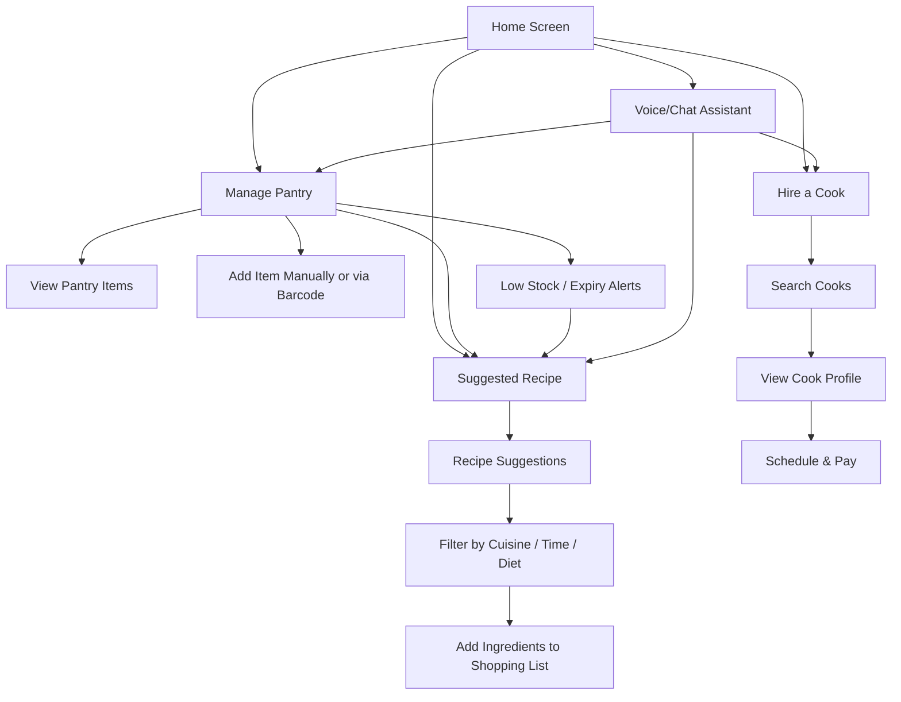

# 🧺 Pantri – Your Smart Kitchen Assistant

**Tagline:** *Smarter Kitchens Start Here.*

---

## 📌 Overview

**Pantri** is a quick-service kitchen assistant app designed to simplify your cooking life by helping you manage pantry items, reduce food waste, hire kitchen help, and get intelligent meal suggestions based on what you already have.

---

## 🎯 Problem Statement

Modern urban households, especially working professionals and nuclear families, often face challenges in managing kitchen tasks:
- Forgetting pantry items or letting groceries expire.
- Repeating meals due to a lack of inspiration.
- Struggling to find reliable kitchen help.
- Inefficient grocery planning.

There is a need for a **smart kitchen assistant app** that can automate pantry tracking, suggest meals based on expiry, and even help with finding verified cooks.

---

## 🚀 Key Features

### 🗃️ Pantry & Grocery Management
- Scan receipts or barcodes to auto-add items.
- Track stock levels, expiry dates, and usage.
- Get low-stock alerts and expiry warnings.

### 🍳 Smart Meal Suggestions
- Recipes based on pantry items nearing expiry.
- Filter by cuisine, time, or dietary needs.
- Add missing ingredients to a smart shopping list.

### 🧑‍🍳 Cook & Kitchen Help Services
- Hire local, verified cooks (full-time/part-time).
- View availability, specialties, and ratings.
- Schedule and pay within the app.

### 📆 Daily/Weekly Planner
- Create kitchen tasks and assign them.
- Shared to-do lists for households.
- Smart reminders for recurring chores.

### 🗣️ Voice & Chat Assistant
- Voice input to add items, ask for recipes, or hire help.
- Chatbot to guide through pantry or recipe suggestions.

### 🛒 Smart Shopping List
- Automatically generated from depleted or expiring items.
- Optionally integrate with grocery delivery platforms.

### 🥗 Health & Diet Integration
- Connect to health apps for meal tracking.
- Suggest meals based on calorie/diet plans.

---

## 🧠 Target Audience
- Working professionals
- Students living alone
- Urban families
- Elderly managing their kitchens independently

---

## 💡 Name Inspiration

**Pantri** – a modern, simplified twist on "pantry" that’s short, memorable, and brandable, in the style of apps like Zepto, Swiggy, and Zomato.

---

## 🏷️ Tagline Suggestions
- *Smarter Kitchens Start Here.*
- *Less Waste. More Taste.*
- *Pantry Perfect. Meals Made Easy.*
- *From Groceries to Great Meals.*

---

## 🖌️ Visual Design Suggestions

### Logo Concepts
- Minimalist pantry icon, chef’s hat with a barcode, or a grocery basket with digital elements.
- Colors: mint green, mustard yellow, orange, slate gray.
- Fonts: Rounded sans-serif (Poppins, Quicksand, Nunito).

---

## 🗺️ User Flow Diagram (Wireframe Style)

## 🧭 User Flow (Wireframe Overview)

1. **Home Screen**
   - Buttons: *Hire a Cook*, *Manage Pantry*, *Suggested Recipe*

2. **Manage Pantry**
   - Item list with expiry indicators and add button

3. **Suggested Recipe**
   - AI-generated recipe cards with cooking steps and ingredients

4. **Hire a Cook**
   - Browse local cooks, filter by cuisine/schedule, and view profiles

---

## 📊 Pitch Deck Outline

1. Title & Tagline  
2. Problem  
3. Solution  
4. Key Features  
5. Market Opportunity  
6. Target Audience  
7. Revenue Model  
8. Visual Demos  
9. Next Steps

---

## 📎 Next Steps

- Build MVP (Minimal Viable Product)
- Create clickable prototype in Figma
- Develop pitch deck or landing page
- Test with early users and iterate

---

## 📍 Status

**Stage:** Ideation  
**Owned by:** Aparna (Developer)  
**App Name:** Pantri  
**Vision:** To make kitchens smarter, waste less food, and reduce the stress of everyday cooking.

---
